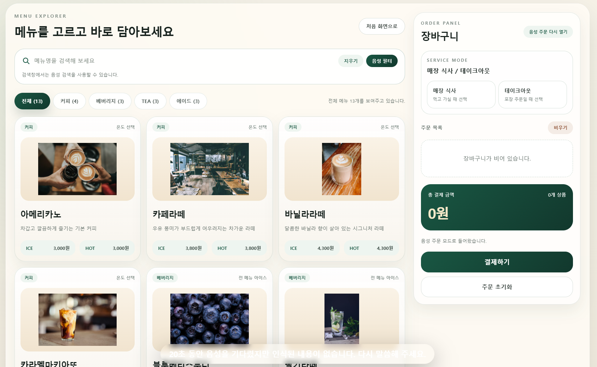
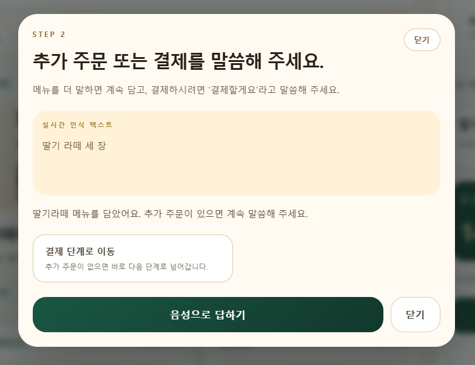
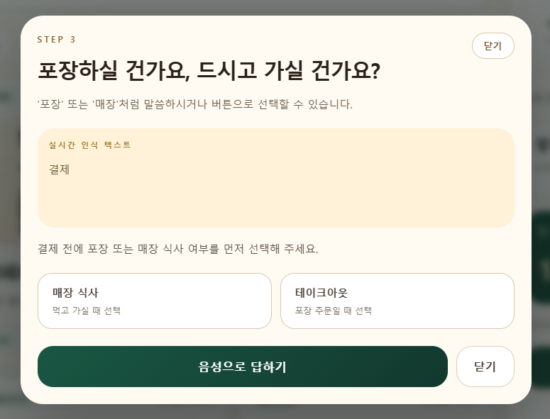
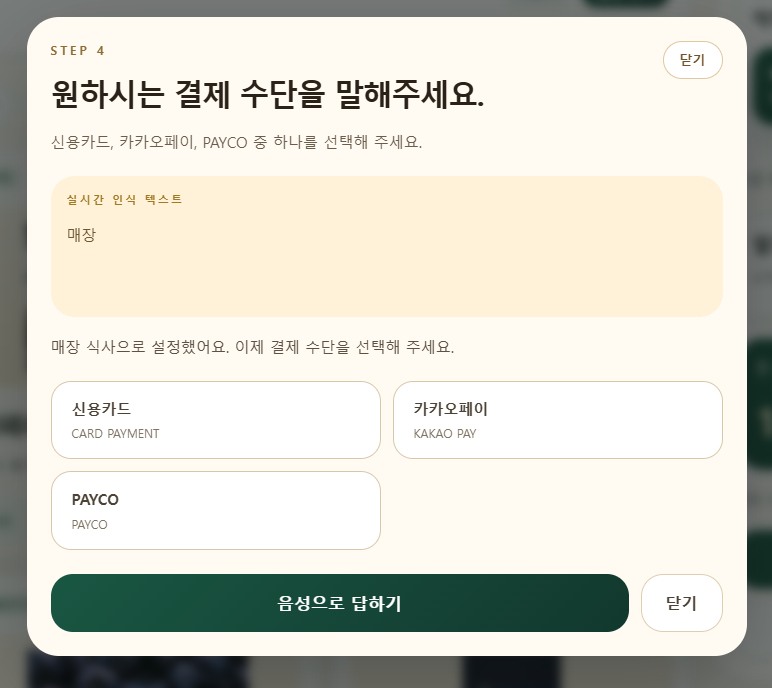
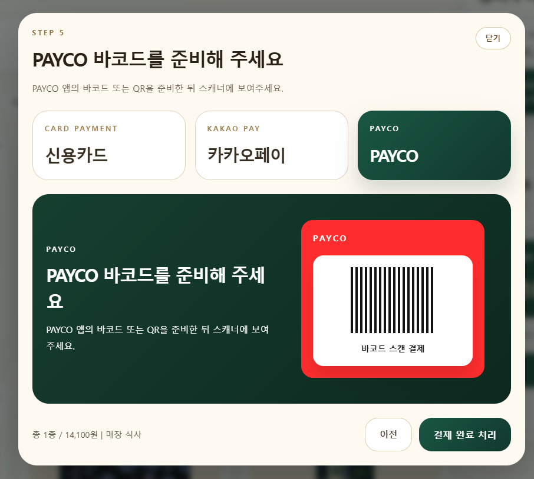
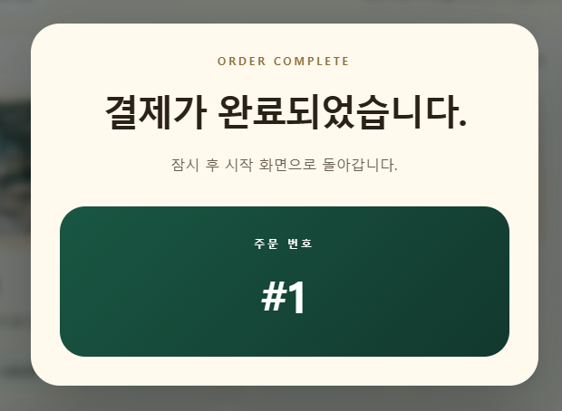

# Voice Order
키오스크 취약 계층을 위한
음성과 터치를 함께 지원하는 카페 키오스크 프로젝트입니다.  
사용자는 시작 화면에서 `터치 주문` 또는 `음성 주문`을 선택하고, 메뉴 탐색부터 장바구니 확인, 결제까지 한 화면 흐름으로 주문할 수 있습니다.

## 프로젝트 한 줄 소개

기존 키오스크의 복잡한 입력 과정을 줄이고, 음성 인식과 직관적인 UI를 결합해 더 쉽게 주문할 수 있도록 만든 웹 기반 키오스크입니다.

## 핵심 기능

- `터치 주문 / 음성 주문` 두 가지 진입 방식 제공
- 음성 안내 멘트와 하단 자막 형태의 실시간 음성 인식 결과 표시
- 인식된 메뉴를 장바구니에 즉시 반영
- 정확히 일치하지 않는 요청은 메뉴 검색 흐름으로 연결
- `매장 식사 / 테이크아웃`, 결제 수단 선택까지 단계적으로 진행
- SQLite 기반 주문 저장

## 주문 흐름

1. 시작 화면에서 주문 방식을 선택합니다.
2. 메뉴를 터치하거나 음성으로 말합니다.
3. 선택한 메뉴가 장바구니에 바로 반영됩니다.
4. 매장 식사 또는 테이크아웃을 선택합니다.
5. 결제 수단을 선택하고 주문을 완료합니다.

## 사용자 화면 예시

웹 화면 사용자 시점에서 메뉴 탐색부터 결제 완료까지 이어지는 실제 흐름입니다.

### 1. 메뉴 탐색 및 장바구니 확인

사용자는 메뉴 목록을 탐색하면서 원하는 음료를 고르고, 오른쪽 장바구니 패널에서 주문 상태와 총 결제 금액을 바로 확인할 수 있습니다.



### 2. 추가 주문 또는 결제 진행

선택한 메뉴가 담기면 음성 인식 결과와 함께 추가 주문을 계속할지, 결제 단계로 넘어갈지를 안내합니다.



### 3. 매장 식사 또는 테이크아웃 선택

결제 전에는 주문 방식에 맞게 `매장 식사` 또는 `테이크아웃`을 선택할 수 있습니다.



### 4. 결제 수단 선택

사용자는 `신용카드`, `카카오페이`, `PAYCO` 중 원하는 결제 수단을 선택합니다.



### 5. 간편결제 바코드 진행

간편결제를 선택한 경우 바코드 또는 QR 스캔 방식으로 결제를 이어갈 수 있습니다.



### 6. 결제 완료

결제가 완료되면 주문 번호와 함께 완료 화면이 표시되어 주문이 정상적으로 접수되었음을 확인할 수 있습니다.



## 기술 스택

- `Python`, `Flask`
- `SQLite`
- `HTML`, `Tailwind CSS`, `JavaScript`
- 브라우저 `Web Speech API`

## 기대 효과

- 키오스크 사용이 익숙하지 않은 사용자도 쉽게 주문 가능
- 음성 주문과 실시간 장바구니 확인으로 사용자 혼란 감소
- 메뉴 탐색, 주문, 결제를 하나의 자연스러운 흐름으로 연결

## 실행 방법

```powershell
python -m venv .venv
.\.venv\Scripts\Activate.ps1
pip install -r requirements.txt
python init_db.py
python app.py
```

브라우저에서 `http://localhost:5000` 으로 접속하면 됩니다.
